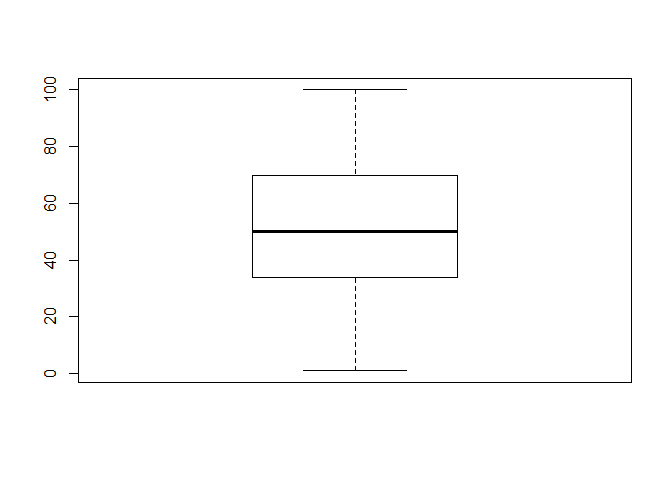

```r
load("QS_Medienseminar_Izydorczyk.Rdata")
```


# Despriptive Statistiken


```r
    attach(QS)
```

## Bedingungen 


```r
    table(bedingung)
```

```
## bedingung
##  aufwärts   abwärts    gleich Kontrolle 
##        42        42        46        44
```

```r
    table(bedingung)/length(bedingung)
```

```
## bedingung
##  aufwärts   abwärts    gleich Kontrolle 
## 0.2413793 0.2413793 0.2643678 0.2528736
```

## Geschlecht 


```r
      table(geschlecht)
```

```
## geschlecht
##   maennlich    weiblich nicht binär 
##          39         135           0
```

```r
      table(geschlecht)/nrow(QS)
```

```
## geschlecht
##   maennlich    weiblich nicht binär 
##   0.2241379   0.7758621   0.0000000
```

```r
      QS %>% group_by(bedingung, geschlecht) %>% count()
```

<div data-pagedtable="false">
  <script data-pagedtable-source type="application/json">
{"columns":[{"label":["bedingung"],"name":[1],"type":["fctr"],"align":["left"]},{"label":["geschlecht"],"name":[2],"type":["fctr"],"align":["left"]},{"label":["n"],"name":[3],"type":["int"],"align":["right"]}],"data":[{"1":"aufwärts","2":"maennlich","3":"7"},{"1":"aufwärts","2":"weiblich","3":"35"},{"1":"abwärts","2":"maennlich","3":"12"},{"1":"abwärts","2":"weiblich","3":"30"},{"1":"gleich","2":"maennlich","3":"10"},{"1":"gleich","2":"weiblich","3":"36"},{"1":"Kontrolle","2":"maennlich","3":"10"},{"1":"Kontrolle","2":"weiblich","3":"34"}],"options":{"columns":{"min":{},"max":[10]},"rows":{"min":[10],"max":[10]},"pages":{}}}
  </script>
</div>
   
## Alter 


```r
      summary(alter)
```

```
##    Min. 1st Qu.  Median    Mean 3rd Qu.    Max. 
##   19.00   29.00   35.00   36.57   43.00   61.00
```

```r
      QS %>% group_by(bedingung) %>% summarise(average_age = mean(alter,na.rm=T))
```

<div data-pagedtable="false">
  <script data-pagedtable-source type="application/json">
{"columns":[{"label":["bedingung"],"name":[1],"type":["fctr"],"align":["left"]},{"label":["average_age"],"name":[2],"type":["dbl"],"align":["right"]}],"data":[{"1":"aufwärts","2":"34.23810"},{"1":"abwärts","2":"38.04762"},{"1":"gleich","2":"35.73913"},{"1":"Kontrolle","2":"38.27273"}],"options":{"columns":{"min":{},"max":[10]},"rows":{"min":[10],"max":[10]},"pages":{}}}
  </script>
</div>

```r
      QS %>% group_by(bedingung, geschlecht) %>% summarise(average_age = mean(alter,na.rm=T))
```

<div data-pagedtable="false">
  <script data-pagedtable-source type="application/json">
{"columns":[{"label":["bedingung"],"name":[1],"type":["fctr"],"align":["left"]},{"label":["geschlecht"],"name":[2],"type":["fctr"],"align":["left"]},{"label":["average_age"],"name":[3],"type":["dbl"],"align":["right"]}],"data":[{"1":"aufwärts","2":"maennlich","3":"40.14286"},{"1":"aufwärts","2":"weiblich","3":"33.05714"},{"1":"abwärts","2":"maennlich","3":"38.91667"},{"1":"abwärts","2":"weiblich","3":"37.70000"},{"1":"gleich","2":"maennlich","3":"33.90000"},{"1":"gleich","2":"weiblich","3":"36.25000"},{"1":"Kontrolle","2":"maennlich","3":"45.10000"},{"1":"Kontrolle","2":"weiblich","3":"36.26471"}],"options":{"columns":{"min":{},"max":[10]},"rows":{"min":[10],"max":[10]},"pages":{}}}
  </script>
</div>

```r
      boxplot(alter)
```

<!-- -->

## Anzahl NAs


```r
      table(Anz_na)
```

```
## Anz_na
##   0   1   2   5 
## 171   1   1   1
```

```r
      summary(Anz_na)
```

```
##    Min. 1st Qu.  Median    Mean 3rd Qu.    Max. 
## 0.00000 0.00000 0.00000 0.04598 0.00000 5.00000
```

```r
      hist(Anz_na)
```

<!-- -->

## Duration (in Sekunden)


```r
      describe(duration) %>% knitr::kable()
```

      vars     n       mean         sd   median    trimmed       mad   min   max   range        skew    kurtosis         se
---  -----  ----  ---------  ---------  -------  ---------  --------  ----  ----  ------  ----------  ----------  ---------
X1       1   174   224.0747   62.02228      212   219.3643   61.5279   120   409     289   0.7170881   0.0420014   4.701897

```r
      hist(duration)
```

<!-- -->

```r
      describeBy(duration, group=bedingung) 
```

```
## 
##  Descriptive statistics by group 
## group: aufwärts
##    vars  n   mean    sd median trimmed   mad min max range skew kurtosis
## X1    1 42 218.19 58.13    215  214.76 66.72 127 359   232 0.35    -0.67
##      se
## X1 8.97
## -------------------------------------------------------- 
## group: abwärts
##    vars  n   mean    sd median trimmed   mad min max range skew kurtosis
## X1    1 42 221.64 65.26    207  213.29 41.51 120 409   289 1.22     1.17
##       se
## X1 10.07
## -------------------------------------------------------- 
## group: gleich
##    vars  n   mean    sd median trimmed   mad min max range skew kurtosis
## X1    1 46 230.61 65.53  226.5  228.11 77.84 134 362   228 0.29    -1.19
##      se
## X1 9.66
## -------------------------------------------------------- 
## group: Kontrolle
##    vars  n   mean    sd median trimmed   mad min max range skew kurtosis
## X1    1 44 225.18 60.11  212.5  220.17 45.22 123 406   283 0.87     0.47
##      se
## X1 9.06
```

```r
      boxplot(duration)
```

<!-- -->

## Tracking (0 = Nein, 1 = JA)


```r
      table(tracking)
```

```
## tracking
##   1 
## 174
```

```r
      table(tracking_dauer)
```

```
## tracking_dauer
##   0   1 
##   2 172
```

```r
      #table(tracking_wie)
```

## Lauferfahrung  


```r
      describe(lauferfahrung) %>% knitr::kable()
```

      vars     n       mean         sd   median    trimmed       mad   min   max   range         skew     kurtosis         se
---  -----  ----  ---------  ---------  -------  ---------  --------  ----  ----  ------  -----------  -----------  ---------
X1       1   174   52.47701   22.04821       50   52.87857   25.9455     1   100      99   -0.1462407   -0.7316385   1.671471

```r
      hist(lauferfahrung)
```

<!-- -->

```r
      describeBy(lauferfahrung, group=bedingung) 
```

```
## 
##  Descriptive statistics by group 
## group: aufwärts
##    vars  n  mean    sd median trimmed   mad min max range  skew kurtosis
## X1    1 42 49.36 22.54     50   50.29 25.95   4  88    84 -0.33    -1.03
##      se
## X1 3.48
## -------------------------------------------------------- 
## group: abwärts
##    vars  n  mean    sd median trimmed   mad min max range skew kurtosis
## X1    1 42 52.62 22.09     50   52.21 27.43  18 100    82 0.18    -1.17
##      se
## X1 3.41
## -------------------------------------------------------- 
## group: gleich
##    vars  n  mean    sd median trimmed   mad min max range  skew kurtosis
## X1    1 46 50.54 21.09     50   51.39 22.24   1  88    87 -0.34    -0.52
##      se
## X1 3.11
## -------------------------------------------------------- 
## group: Kontrolle
##    vars  n  mean    sd median trimmed   mad min max range  skew kurtosis
## X1    1 44 57.34 22.42   57.5   57.67 22.24  13 100    87 -0.12    -0.82
##      se
## X1 3.38
```

```r
      boxplot(lauferfahrung)
```

<!-- -->

## KM pro Woche


```r
      describe(km_per_week) %>% knitr::kable()
```

      vars     n      mean         sd   median    trimmed     mad   min   max   range       skew   kurtosis         se
---  -----  ----  --------  ---------  -------  ---------  ------  ----  ----  ------  ---------  ---------  ---------
X1       1   173   24.1474   14.55682       20   22.21942   7.413     2    90      88   1.595156     3.4092   1.106735

```r
      hist(km_per_week)
```

<!-- -->

```r
      describeBy(km_per_week, group=bedingung)
```

```
## 
##  Descriptive statistics by group 
## group: aufwärts
##    vars  n  mean    sd median trimmed   mad min max range skew kurtosis
## X1    1 42 23.45 16.49     20   21.29 14.83   2  80    78 1.31     1.62
##      se
## X1 2.54
## -------------------------------------------------------- 
## group: abwärts
##    vars  n  mean    sd median trimmed   mad min max range skew kurtosis
## X1    1 41 26.22 15.71     23   23.91 10.38   6  90    84  2.1     5.48
##      se
## X1 2.45
## -------------------------------------------------------- 
## group: gleich
##    vars  n  mean    sd median trimmed  mad min max range skew kurtosis
## X1    1 46 21.39 11.69     20   20.22 7.41 4.5  60  55.5 1.16     1.52
##      se
## X1 1.72
## -------------------------------------------------------- 
## group: Kontrolle
##    vars  n  mean    sd median trimmed  mad min max range skew kurtosis
## X1    1 44 25.76 14.16     20   23.96 8.52   8  70    62 1.27     1.26
##      se
## X1 2.13
```

```r
      boxplot(km_per_week)
```

<!-- -->


## KM n?chste Woche
      

```r
      describe(km_next_week) %>% knitr::kable()
```

      vars     n       mean         sd   median    trimmed      mad   min   max   range       skew   kurtosis         se
---  -----  ----  ---------  ---------  -------  ---------  -------  ----  ----  ------  ---------  ---------  ---------
X1       1   174   25.28736   16.81034       20   23.02857   14.826     0    95      95   1.420003   2.452843   1.274388

```r
      hist(km_next_week)
```

<!-- -->

```r
      describeBy(km_next_week, group=bedingung)
```

```
## 
##  Descriptive statistics by group 
## group: aufwärts
##    vars  n  mean    sd median trimmed   mad min max range skew kurtosis
## X1    1 42 24.52 18.36     20   22.03 14.83   0  80    80 1.32     1.61
##      se
## X1 2.83
## -------------------------------------------------------- 
## group: abwärts
##    vars  n  mean    sd median trimmed   mad min max range skew kurtosis
## X1    1 42 27.19 18.72     24   24.15 14.83   5  95    90 1.69     3.17
##      se
## X1 2.89
## -------------------------------------------------------- 
## group: gleich
##    vars  n  mean    sd median trimmed   mad min max range skew kurtosis
## X1    1 46 21.74 14.01     20   20.26 11.12   0  60    60 0.99     0.78
##      se
## X1 2.07
## -------------------------------------------------------- 
## group: Kontrolle
##    vars  n  mean    sd median trimmed   mad min max range skew kurtosis
## X1    1 44 27.91 15.85     28   25.83 14.83   8  70    62 1.13     0.96
##      se
## X1 2.39
```
      
## Differenz
      

```r
      describe(km_next_week-km_per_week) %>% knitr::kable()
```

      vars     n       mean         sd   median    trimmed      mad   min   max   range        skew   kurtosis          se
---  -----  ----  ---------  ---------  -------  ---------  -------  ----  ----  ------  ----------  ---------  ----------
X1       1   173   1.083815   6.896466        0   1.053957   4.4478   -30    40      70   0.4696435   7.791041   0.5243286

```r
      hist(km_next_week-km_per_week)
```

<!-- -->

```r
      describeBy(km_next_week-km_per_week, group=bedingung) 
```

```
## 
##  Descriptive statistics by group 
## group: aufwärts
##    vars  n mean   sd median trimmed  mad min max range  skew kurtosis   se
## X1    1 42 1.07 6.58      0    1.18 0.74 -20  20    40 -0.38     3.87 1.01
## -------------------------------------------------------- 
## group: abwärts
##    vars  n mean  sd median trimmed  mad min max range skew kurtosis   se
## X1    1 41 0.78 6.6      0    0.55 5.93 -13  20    33 0.46     0.63 1.03
## -------------------------------------------------------- 
## group: gleich
##    vars  n mean   sd median trimmed  mad min max range  skew kurtosis   se
## X1    1 46 0.35 5.26      0    0.42 4.45 -12  10    22 -0.07    -0.09 0.78
## -------------------------------------------------------- 
## group: Kontrolle
##    vars  n mean   sd median trimmed  mad min max range skew kurtosis   se
## X1    1 44 2.15 8.82      0    2.21 2.59 -30  40    70 0.66     8.99 1.33
```

```r
      boxplot(km_next_week)
```

<!-- -->
      
      
      

```r
      detach(QS)
```


## Korrelation der Motivation zu laufen ITems


```r
corr.test(QS[,c("diff_rs","MO_laufen")])
```

```
## Call:corr.test(x = QS[, c("diff_rs", "MO_laufen")])
## Correlation matrix 
##           diff_rs MO_laufen
## diff_rs      1.00      0.29
## MO_laufen    0.29      1.00
## Sample Size 
##           diff_rs MO_laufen
## diff_rs       173       173
## MO_laufen     173       174
## Probability values (Entries above the diagonal are adjusted for multiple tests.) 
##           diff_rs MO_laufen
## diff_rs         0         0
## MO_laufen       0         0
## 
##  To see confidence intervals of the correlations, print with the short=FALSE option
```


# Filtern von Personen 

Die Zeiten der Personen sehen alle sinnvoll aus, siehe Duration.  Es gibt jedoch eine Personen mit relativ viele NAs


```r
temp <- dplyr::select(QS,geschlecht:untersucht,Anz_na) %>% filter(.,Anz_na>0)
```

Anscheinend haben diese Personen fehlende Werte bei den Motivationsskalen. -> Werden erstmal auch


```r
QS <- filter(QS,Anz_na==0)
```
 

Die Person mit NA auf km_peer_Week ausschlie?en. 


```r
QS <- filter(QS,!is.na(km_per_week))
```
   
Person die weniger als 2 Woche trackt ausschlie?en 
     

```r
QS <- filter(QS,tracking_dauer==1)
```
  
**Es bleiben noch 169 Personen.**

## Neue Demographie und deskriptive Statistiken

### Geschlecht 


```r
      table(QS$geschlecht)
```

```
## 
##   maennlich    weiblich nicht binär 
##          38         131           0
```

```r
      table(QS$geschlecht)/nrow(QS)
```

```
## 
##   maennlich    weiblich nicht binär 
##   0.2248521   0.7751479   0.0000000
```

```r
      QS %>% group_by(bedingung, geschlecht) %>% count()
```

<div data-pagedtable="false">
  <script data-pagedtable-source type="application/json">
{"columns":[{"label":["bedingung"],"name":[1],"type":["fctr"],"align":["left"]},{"label":["geschlecht"],"name":[2],"type":["fctr"],"align":["left"]},{"label":["n"],"name":[3],"type":["int"],"align":["right"]}],"data":[{"1":"aufwärts","2":"maennlich","3":"7"},{"1":"aufwärts","2":"weiblich","3":"34"},{"1":"abwärts","2":"maennlich","3":"11"},{"1":"abwärts","2":"weiblich","3":"30"},{"1":"gleich","2":"maennlich","3":"10"},{"1":"gleich","2":"weiblich","3":"33"},{"1":"Kontrolle","2":"maennlich","3":"10"},{"1":"Kontrolle","2":"weiblich","3":"34"}],"options":{"columns":{"min":{},"max":[10]},"rows":{"min":[10],"max":[10]},"pages":{}}}
  </script>
</div>
   
### Alter 


```r
      describe(QS$alter) %>% knitr::kable()
```

      vars     n       mean         sd   median    trimmed       mad   min   max   range        skew     kurtosis          se
---  -----  ----  ---------  ---------  -------  ---------  --------  ----  ----  ------  ----------  -----------  ----------
X1       1   169   36.63314   9.782533       35   36.10219   10.3782    19    61      42   0.4649877   -0.3160167   0.7525025

```r
      QS %>% group_by(bedingung) %>% summarise(average_age = mean(alter,na.rm=T))
```

<div data-pagedtable="false">
  <script data-pagedtable-source type="application/json">
{"columns":[{"label":["bedingung"],"name":[1],"type":["fctr"],"align":["left"]},{"label":["average_age"],"name":[2],"type":["dbl"],"align":["right"]}],"data":[{"1":"aufwärts","2":"34.26829"},{"1":"abwärts","2":"37.85366"},{"1":"gleich","2":"36.04651"},{"1":"Kontrolle","2":"38.27273"}],"options":{"columns":{"min":{},"max":[10]},"rows":{"min":[10],"max":[10]},"pages":{}}}
  </script>
</div>

```r
      QS %>% group_by(bedingung, geschlecht) %>% summarise(average_age = mean(alter,na.rm=T))
```

<div data-pagedtable="false">
  <script data-pagedtable-source type="application/json">
{"columns":[{"label":["bedingung"],"name":[1],"type":["fctr"],"align":["left"]},{"label":["geschlecht"],"name":[2],"type":["fctr"],"align":["left"]},{"label":["average_age"],"name":[3],"type":["dbl"],"align":["right"]}],"data":[{"1":"aufwärts","2":"maennlich","3":"40.14286"},{"1":"aufwärts","2":"weiblich","3":"33.05882"},{"1":"abwärts","2":"maennlich","3":"38.27273"},{"1":"abwärts","2":"weiblich","3":"37.70000"},{"1":"gleich","2":"maennlich","3":"33.90000"},{"1":"gleich","2":"weiblich","3":"36.69697"},{"1":"Kontrolle","2":"maennlich","3":"45.10000"},{"1":"Kontrolle","2":"weiblich","3":"36.26471"}],"options":{"columns":{"min":{},"max":[10]},"rows":{"min":[10],"max":[10]},"pages":{}}}
  </script>
</div>

```r
      boxplot(QS$alter)
```

<!-- -->

### Lauferfahrung/Km peer Week


```r
levels(QS$bedingung) <- c("upwards","downwards","equal","control")


table(QS$bedingung, QS$geschlecht)
```

```
##            
##             maennlich weiblich nicht binär
##   upwards           7       34           0
##   downwards        11       30           0
##   equal            10       33           0
##   control          10       34           0
```

```r
QS %>% group_by(.,bedingung) %>% 
             dplyr::summarize(., meanKM    = mean(km_per_week),
                                 sdKM      = sd(km_per_week), 
                                 meanLE    = mean(lauferfahrung),
                                 sdLE      = sd(lauferfahrung),
                                 meanAge   = mean(alter),
                                 sdAge     = sd(alter))  
```

<div data-pagedtable="false">
  <script data-pagedtable-source type="application/json">
{"columns":[{"label":["bedingung"],"name":[1],"type":["fctr"],"align":["left"]},{"label":["meanKM"],"name":[2],"type":["dbl"],"align":["right"]},{"label":["sdKM"],"name":[3],"type":["dbl"],"align":["right"]},{"label":["meanLE"],"name":[4],"type":["dbl"],"align":["right"]},{"label":["sdLE"],"name":[5],"type":["dbl"],"align":["right"]},{"label":["meanAge"],"name":[6],"type":["dbl"],"align":["right"]},{"label":["sdAge"],"name":[7],"type":["dbl"],"align":["right"]}],"data":[{"1":"upwards","2":"23.14634","3":"16.57040","4":"49.17073","5":"22.78914","6":"34.26829","7":"9.716029"},{"1":"downwards","2":"26.21951","3":"15.71068","4":"51.97561","5":"21.95961","6":"37.85366","7":"10.140417"},{"1":"equal","2":"21.02326","3":"11.49066","4":"49.93023","5":"21.62163","6":"36.04651","7":"10.279322"},{"1":"control","2":"25.76136","3":"14.15672","4":"57.34091","5":"22.42294","6":"38.27273","7":"8.795780"}],"options":{"columns":{"min":{},"max":[10]},"rows":{"min":[10],"max":[10]},"pages":{}}}
  </script>
</div>

```r
describe(QS$km_per_week) %>% knitr::kable()
```

      vars     n       mean         sd   median    trimmed     mad   min   max   range       skew   kurtosis         se
---  -----  ----  ---------  ---------  -------  ---------  ------  ----  ----  ------  ---------  ---------  ---------
X1       1   169   24.03254   14.59137       20   22.09854   7.413     2    90      88   1.625966   3.521593   1.122413

```r
describe(QS$lauferfahrung) %>% knitr::kable()
```

      vars     n      mean         sd   median    trimmed       mad   min   max   range         skew     kurtosis         se
---  -----  ----  --------  ---------  -------  ---------  --------  ----  ----  ------  -----------  -----------  ---------
X1       1   169   52.1716   22.23789       50   52.47445   26.6868     1   100      99   -0.1176628   -0.7637779   1.710607

```r
psych::corr.test(QS[,c("lauferfahrung", "km_per_week", "alter")])
```

```
## Call:psych::corr.test(x = QS[, c("lauferfahrung", "km_per_week", "alter")])
## Correlation matrix 
##               lauferfahrung km_per_week alter
## lauferfahrung          1.00        0.42  0.11
## km_per_week            0.42        1.00  0.14
## alter                  0.11        0.14  1.00
## Sample Size 
## [1] 169
## Probability values (Entries above the diagonal are adjusted for multiple tests.) 
##               lauferfahrung km_per_week alter
## lauferfahrung          0.00        0.00  0.17
## km_per_week            0.00        0.00  0.15
## alter                  0.17        0.08  0.00
## 
##  To see confidence intervals of the correlations, print with the short=FALSE option
```


# Reliabilit?ten (Cronbachs Alpha)

## Motivation zu tracken 

### Self - Entertainment


```r
psych::alpha(QS[,11:15])
```

```
## 
## Reliability analysis   
## Call: psych::alpha(x = QS[, 11:15])
## 
##   raw_alpha std.alpha G6(smc) average_r S/N   ase mean  sd
##       0.88      0.88    0.88       0.6 7.5 0.015  4.1 1.5
## 
##  lower alpha upper     95% confidence boundaries
## 0.85 0.88 0.91 
## 
##  Reliability if an item is dropped:
##                raw_alpha std.alpha G6(smc) average_r S/N alpha se
## MO_tracking_01      0.85      0.85    0.84      0.58 5.6    0.020
## MO_tracking_02      0.84      0.84    0.82      0.56 5.1    0.021
## MO_tracking_03      0.86      0.86    0.84      0.61 6.3    0.017
## MO_tracking_04      0.88      0.88    0.86      0.64 7.3    0.015
## MO_tracking_05      0.85      0.85    0.85      0.59 5.7    0.019
## 
##  Item statistics 
##                  n raw.r std.r r.cor r.drop mean  sd
## MO_tracking_01 169  0.85  0.85  0.80   0.75  3.7 1.8
## MO_tracking_02 169  0.88  0.88  0.86   0.79  4.3 1.8
## MO_tracking_03 169  0.79  0.80  0.76   0.68  4.6 1.7
## MO_tracking_04 169  0.76  0.76  0.67   0.62  3.3 1.9
## MO_tracking_05 169  0.83  0.84  0.78   0.74  4.4 1.7
## 
## Non missing response frequency for each item
##                   1    2    3    4    5    6    7 miss
## MO_tracking_01 0.14 0.17 0.15 0.18 0.20 0.11 0.07    0
## MO_tracking_02 0.09 0.13 0.12 0.14 0.21 0.18 0.12    0
## MO_tracking_03 0.05 0.11 0.10 0.18 0.21 0.24 0.11    0
## MO_tracking_04 0.23 0.18 0.12 0.17 0.15 0.09 0.06    0
## MO_tracking_05 0.05 0.13 0.11 0.18 0.22 0.20 0.09    0
```

### Self - Association


```r
psych::alpha(QS[,16:19])
```

```
## 
## Reliability analysis   
## Call: psych::alpha(x = QS[, 16:19])
## 
##   raw_alpha std.alpha G6(smc) average_r S/N   ase mean  sd
##       0.85      0.85    0.84       0.6 5.9 0.019    3 1.5
## 
##  lower alpha upper     95% confidence boundaries
## 0.82 0.85 0.89 
## 
##  Reliability if an item is dropped:
##                raw_alpha std.alpha G6(smc) average_r S/N alpha se
## MO_tracking_06      0.81      0.81    0.75      0.58 4.2    0.025
## MO_tracking_07      0.83      0.83    0.78      0.62 4.9    0.022
## MO_tracking_08      0.81      0.81    0.76      0.59 4.4    0.025
## MO_tracking_09      0.80      0.81    0.75      0.58 4.2    0.027
## 
##  Item statistics 
##                  n raw.r std.r r.cor r.drop mean  sd
## MO_tracking_06 169  0.84  0.85  0.78   0.71  2.9 1.7
## MO_tracking_07 169  0.79  0.81  0.72   0.65  2.9 1.6
## MO_tracking_08 169  0.85  0.84  0.77   0.70  3.7 2.0
## MO_tracking_09 169  0.85  0.84  0.78   0.73  2.6 1.7
## 
## Non missing response frequency for each item
##                   1    2    3    4    5    6    7 miss
## MO_tracking_06 0.30 0.19 0.14 0.16 0.13 0.07 0.02    0
## MO_tracking_07 0.25 0.23 0.12 0.23 0.12 0.05 0.01    0
## MO_tracking_08 0.20 0.16 0.11 0.12 0.17 0.16 0.09    0
## MO_tracking_09 0.38 0.22 0.13 0.08 0.11 0.07 0.02    0
```

### Self - Design


```r
psych::alpha(QS[,20:24])
```

```
## 
## Reliability analysis   
## Call: psych::alpha(x = QS[, 20:24])
## 
##   raw_alpha std.alpha G6(smc) average_r S/N   ase mean  sd
##       0.87      0.88    0.86      0.59 7.1 0.015  4.2 1.5
## 
##  lower alpha upper     95% confidence boundaries
## 0.84 0.87 0.9 
## 
##  Reliability if an item is dropped:
##                raw_alpha std.alpha G6(smc) average_r S/N alpha se
## MO_tracking_10      0.87      0.87    0.85      0.63 6.7    0.017
## MO_tracking_11      0.84      0.84    0.81      0.57 5.4    0.020
## MO_tracking_12      0.86      0.86    0.83      0.61 6.2    0.018
## MO_tracking_13      0.84      0.84    0.81      0.57 5.2    0.021
## MO_tracking_14      0.83      0.83    0.79      0.56 5.0    0.021
## 
##  Item statistics 
##                  n raw.r std.r r.cor r.drop mean  sd
## MO_tracking_10 169  0.77  0.76  0.66   0.62  4.3 1.9
## MO_tracking_11 169  0.83  0.84  0.80   0.73  4.6 1.8
## MO_tracking_12 169  0.79  0.78  0.70   0.66  4.0 1.9
## MO_tracking_13 169  0.85  0.85  0.80   0.75  3.9 1.8
## MO_tracking_14 169  0.85  0.86  0.84   0.77  4.4 1.7
## 
## Non missing response frequency for each item
##                   1    2    3    4    5    6    7 miss
## MO_tracking_10 0.12 0.08 0.14 0.14 0.18 0.22 0.11    0
## MO_tracking_11 0.09 0.07 0.10 0.11 0.27 0.24 0.11    0
## MO_tracking_12 0.17 0.11 0.08 0.18 0.24 0.12 0.11    0
## MO_tracking_13 0.15 0.12 0.09 0.17 0.24 0.16 0.05    0
## MO_tracking_14 0.09 0.08 0.11 0.16 0.24 0.25 0.07    0
```

### Self - Discipline


```r
psych::alpha(QS[,25:27])
```

```
## 
## Reliability analysis   
## Call: psych::alpha(x = QS[, 25:27])
## 
##   raw_alpha std.alpha G6(smc) average_r S/N   ase mean  sd
##       0.73      0.76    0.69      0.52 3.2 0.032  5.4 1.2
## 
##  lower alpha upper     95% confidence boundaries
## 0.67 0.73 0.8 
## 
##  Reliability if an item is dropped:
##                raw_alpha std.alpha G6(smc) average_r S/N alpha se
## MO_tracking_15      0.71      0.72    0.56      0.56 2.6    0.043
## MO_tracking_16      0.69      0.72    0.56      0.56 2.5    0.044
## MO_tracking_17      0.53      0.60    0.43      0.43 1.5    0.059
## 
##  Item statistics 
##                  n raw.r std.r r.cor r.drop mean  sd
## MO_tracking_15 169  0.73  0.80  0.64   0.55  6.0 1.0
## MO_tracking_16 169  0.87  0.81  0.65   0.57  4.6 1.8
## MO_tracking_17 169  0.86  0.86  0.76   0.66  5.5 1.4
## 
## Non missing response frequency for each item
##                   1    2    3    4    5    6    7 miss
## MO_tracking_15 0.01 0.00 0.01 0.05 0.18 0.38 0.38    0
## MO_tracking_16 0.10 0.07 0.09 0.17 0.21 0.22 0.14    0
## MO_tracking_17 0.03 0.02 0.03 0.12 0.18 0.36 0.25    0
```


### Self - Healing


```r
psych::alpha(QS[,28:29])
```

```
## 
## Reliability analysis   
## Call: psych::alpha(x = QS[, 28:29])
## 
##   raw_alpha std.alpha G6(smc) average_r S/N   ase mean  sd
##        0.8       0.8    0.66      0.66 3.9 0.031  2.5 1.4
## 
##  lower alpha upper     95% confidence boundaries
## 0.73 0.8 0.86 
## 
##  Reliability if an item is dropped:
##                raw_alpha std.alpha G6(smc) average_r S/N alpha se
## MO_tracking_18      0.66      0.66    0.44      0.66  NA       NA
## MO_tracking_19      0.66      0.66    0.44      0.66  NA       NA
## 
##  Item statistics 
##                  n raw.r std.r r.cor r.drop mean  sd
## MO_tracking_18 169  0.91  0.91  0.74   0.66  2.6 1.6
## MO_tracking_19 169  0.91  0.91  0.74   0.66  2.3 1.6
## 
## Non missing response frequency for each item
##                   1    2    3    4    5    6    7 miss
## MO_tracking_18 0.29 0.28 0.17 0.13 0.07 0.04 0.02    0
## MO_tracking_19 0.43 0.24 0.11 0.13 0.05 0.02 0.02    0
```

### Self - Overall


```r
psych::alpha(QS[,11:29])#overall
```

```
## 
## Reliability analysis   
## Call: psych::alpha(x = QS[, 11:29])
## 
##   raw_alpha std.alpha G6(smc) average_r S/N  ase mean  sd
##       0.91      0.91    0.95      0.35  10 0.01  3.9 1.1
## 
##  lower alpha upper     95% confidence boundaries
## 0.89 0.91 0.93 
## 
##  Reliability if an item is dropped:
##                raw_alpha std.alpha G6(smc) average_r  S/N alpha se
## MO_tracking_01      0.90      0.90    0.94      0.34  9.3    0.011
## MO_tracking_02      0.90      0.90    0.94      0.34  9.5    0.011
## MO_tracking_03      0.91      0.91    0.94      0.35  9.8    0.010
## MO_tracking_04      0.90      0.90    0.94      0.34  9.5    0.011
## MO_tracking_05      0.90      0.90    0.94      0.34  9.3    0.011
## MO_tracking_06      0.90      0.91    0.94      0.35  9.6    0.011
## MO_tracking_07      0.90      0.91    0.94      0.35  9.5    0.011
## MO_tracking_08      0.90      0.91    0.94      0.35  9.6    0.011
## MO_tracking_09      0.90      0.91    0.94      0.35  9.6    0.011
## MO_tracking_10      0.90      0.91    0.94      0.35  9.6    0.011
## MO_tracking_11      0.90      0.91    0.94      0.35  9.5    0.011
## MO_tracking_12      0.90      0.90    0.94      0.34  9.3    0.011
## MO_tracking_13      0.90      0.90    0.94      0.35  9.5    0.011
## MO_tracking_14      0.90      0.90    0.94      0.34  9.4    0.011
## MO_tracking_15      0.91      0.90    0.94      0.35  9.5    0.011
## MO_tracking_16      0.90      0.91    0.94      0.35  9.6    0.011
## MO_tracking_17      0.91      0.91    0.94      0.35  9.7    0.011
## MO_tracking_18      0.91      0.91    0.94      0.36 10.1    0.010
## MO_tracking_19      0.91      0.91    0.94      0.35  9.9    0.010
## 
##  Item statistics 
##                  n raw.r std.r r.cor r.drop mean  sd
## MO_tracking_01 169  0.71  0.70  0.69   0.66  3.7 1.8
## MO_tracking_02 169  0.65  0.65  0.64   0.60  4.3 1.8
## MO_tracking_03 169  0.54  0.53  0.52   0.47  4.6 1.7
## MO_tracking_04 169  0.65  0.65  0.63   0.59  3.3 1.9
## MO_tracking_05 169  0.70  0.70  0.69   0.65  4.4 1.7
## MO_tracking_06 169  0.62  0.61  0.60   0.56  2.9 1.7
## MO_tracking_07 169  0.62  0.63  0.61   0.57  2.9 1.6
## MO_tracking_08 169  0.63  0.62  0.61   0.56  3.7 2.0
## MO_tracking_09 169  0.62  0.61  0.60   0.56  2.6 1.7
## MO_tracking_10 169  0.62  0.61  0.58   0.55  4.3 1.9
## MO_tracking_11 169  0.63  0.63  0.61   0.57  4.6 1.8
## MO_tracking_12 169  0.72  0.71  0.70   0.67  4.0 1.9
## MO_tracking_13 169  0.64  0.64  0.63   0.59  3.9 1.8
## MO_tracking_14 169  0.67  0.68  0.67   0.62  4.4 1.7
## MO_tracking_15 169  0.60  0.63  0.60   0.57  6.0 1.0
## MO_tracking_16 169  0.62  0.62  0.59   0.55  4.6 1.8
## MO_tracking_17 169  0.55  0.57  0.54   0.50  5.5 1.4
## MO_tracking_18 169  0.43  0.44  0.41   0.37  2.6 1.6
## MO_tracking_19 169  0.51  0.52  0.49   0.45  2.3 1.6
## 
## Non missing response frequency for each item
##                   1    2    3    4    5    6    7 miss
## MO_tracking_01 0.14 0.17 0.15 0.18 0.20 0.11 0.07    0
## MO_tracking_02 0.09 0.13 0.12 0.14 0.21 0.18 0.12    0
## MO_tracking_03 0.05 0.11 0.10 0.18 0.21 0.24 0.11    0
## MO_tracking_04 0.23 0.18 0.12 0.17 0.15 0.09 0.06    0
## MO_tracking_05 0.05 0.13 0.11 0.18 0.22 0.20 0.09    0
## MO_tracking_06 0.30 0.19 0.14 0.16 0.13 0.07 0.02    0
## MO_tracking_07 0.25 0.23 0.12 0.23 0.12 0.05 0.01    0
## MO_tracking_08 0.20 0.16 0.11 0.12 0.17 0.16 0.09    0
## MO_tracking_09 0.38 0.22 0.13 0.08 0.11 0.07 0.02    0
## MO_tracking_10 0.12 0.08 0.14 0.14 0.18 0.22 0.11    0
## MO_tracking_11 0.09 0.07 0.10 0.11 0.27 0.24 0.11    0
## MO_tracking_12 0.17 0.11 0.08 0.18 0.24 0.12 0.11    0
## MO_tracking_13 0.15 0.12 0.09 0.17 0.24 0.16 0.05    0
## MO_tracking_14 0.09 0.08 0.11 0.16 0.24 0.25 0.07    0
## MO_tracking_15 0.01 0.00 0.01 0.05 0.18 0.38 0.38    0
## MO_tracking_16 0.10 0.07 0.09 0.17 0.21 0.22 0.14    0
## MO_tracking_17 0.03 0.02 0.03 0.12 0.18 0.36 0.25    0
## MO_tracking_18 0.29 0.28 0.17 0.13 0.07 0.04 0.02    0
## MO_tracking_19 0.43 0.24 0.11 0.13 0.05 0.02 0.02    0
```


```r
    # QS$MO_tracking_self_entertainment <- rowMeans(QS[,11:15],na.rm=TRUE)
    # QS$MO_tracking_self_association   <- rowMeans(QS[,16:19],na.rm=TRUE)
    # QS$MO_tracking_self_design        <- rowMeans(QS[,20:24],na.rm=TRUE)
    # QS$MO_tracking_self_discipline    <- rowMeans(QS[,25:27],na.rm=TRUE)
    # QS$MO_tracking_self_healing       <- rowMeans(QS[,28:29],na.rm=TRUE)  
```


## Motivation zu Laufen


```r
corr.test(QS[,c("diff_rs","MO_laufen","diff","km_next_week")])
```

```
## Call:corr.test(x = QS[, c("diff_rs", "MO_laufen", "diff", "km_next_week")])
## Correlation matrix 
##              diff_rs MO_laufen diff km_next_week
## diff_rs         1.00      0.28 1.00         0.51
## MO_laufen       0.28      1.00 0.28         0.24
## diff            1.00      0.28 1.00         0.51
## km_next_week    0.51      0.24 0.51         1.00
## Sample Size 
## [1] 169
## Probability values (Entries above the diagonal are adjusted for multiple tests.) 
##              diff_rs MO_laufen diff km_next_week
## diff_rs            0         0    0            0
## MO_laufen          0         0    0            0
## diff               0         0    0            0
## km_next_week       0         0    0            0
## 
##  To see confidence intervals of the correlations, print with the short=FALSE option
```

```r
psych::alpha(QS[,c("diff_rs","MO_laufen")])
```

```
## 
## Reliability analysis   
## Call: psych::alpha(x = QS[, c("diff_rs", "MO_laufen")])
## 
##   raw_alpha std.alpha G6(smc) average_r  S/N   ase mean sd
##       0.34      0.44    0.28      0.28 0.77 0.073   62 13
## 
##  lower alpha upper     95% confidence boundaries
## 0.2 0.34 0.48 
## 
##  Reliability if an item is dropped:
##           raw_alpha std.alpha G6(smc) average_r S/N alpha se
## diff_rs        0.28      0.28   0.078      0.28  NA       NA
## MO_laufen      0.28      0.28   0.078      0.28  NA       NA
## 
##  Item statistics 
##             n raw.r std.r r.cor r.drop mean   sd
## diff_rs   169  0.60   0.8  0.42   0.28   45  9.9
## MO_laufen 169  0.94   0.8  0.42   0.28   79 22.5
```


# Inferenz Statistik

## ANOVA - Motivation zu Laufen 

### Deskriptive Mittelwerte


```r
describeBy(QS$MO_laufen_ges, group=QS$bedingung)
```

```
## 
##  Descriptive statistics by group 
## group: upwards
##    vars  n  mean    sd median trimmed  mad  min   max range  skew kurtosis
## X1    1 41 63.26 12.24  63.64   64.37 9.95 7.14 85.71 78.57 -2.17     8.42
##      se
## X1 1.91
## -------------------------------------------------------- 
## group: downwards
##    vars  n  mean    sd median trimmed   mad   min   max range  skew
## X1    1 41 60.55 14.53   63.5   62.24 11.75 23.86 85.71 61.86 -0.91
##    kurtosis   se
## X1     0.22 2.27
## -------------------------------------------------------- 
## group: equal
##    vars  n  mean    sd median trimmed  mad   min   max range  skew
## X1    1 43 59.01 13.57   61.5   60.85 9.74 17.86 78.57 60.71 -1.41
##    kurtosis   se
## X1     1.97 2.07
## -------------------------------------------------------- 
## group: control
##    vars  n  mean    sd median trimmed mad   min max range  skew kurtosis
## X1    1 44 63.93 13.39  67.82   65.48 9.9 21.43  90 68.57 -1.25     1.98
##      se
## X1 2.02
```

### Plots


```r
id <- QS %>% group_by(.,bedingung) %>% 
             dplyr::summarize(., mean    = mean(MO_laufen_ges),
                                 se      = sd(MO_laufen_ges)/sqrt(length(MO_laufen_ges)))  
QS$VPN <- 1:nrow(QS)


ggplot(id, aes(x=bedingung, y=mean,fill=bedingung)) + 
    geom_bar(position=position_dodge(), stat="identity",colour="black",, width=.5) +
    scale_fill_manual(values=c("grey80","grey60","grey40", "grey20")) +
    scale_y_continuous("Motivation to jog", expand=c(0,0), limits = c(0, 85) ) +
    scale_x_discrete(name="Condition", labels=c("upwards", "downwards","equal","control")) +
    geom_errorbar(aes(ymin=mean-se, ymax=mean+se), width=.2, alpha = .4, position=position_dodge(.9))  +
    geom_point(data=QS, aes(x=bedingung, y=MO_laufen_ges,group=VPN),shape = 21, alpha = .2,position=position_dodge(0.2)) +
     theme_bw() +
        labs(
          #title = "Correct Rejection Rate ",
          x = "Bedingungen",
          y = "Motivation zu laufen",
          color = NULL
        ) + guides(fill=FALSE)
```

```
## Warning: Removed 3 rows containing missing values (geom_point).
```

<!-- -->

```r
ggplot(QS, aes(x=MO_laufen_ges,fill=bedingung)) +
          geom_density(alpha=0.4) +
          theme_bw() +
           scale_x_continuous(expand=c(0,0), limits = c(0, 100) ) +
              labs(
                title = "Verteilung der Motivation zu laufen",
                x = "Motivation zu laufen",
                y = "H?ufigkeit",
                color = NULL
              ) 
```

<!-- -->

```r
#ggsave("plotMotivationszulaufenDistribution.png",dpi=900,width=12,height=7, units = "cm",bg = "transparent")
```

### ANOVA 


```r
library(lsr)
motLauf <-aov(MO_laufen_ges~bedingung,data=QS)
summary(motLauf)
```

```
##              Df Sum Sq Mean Sq F value Pr(>F)
## bedingung     3    683   227.6   1.257  0.291
## Residuals   165  29875   181.1
```

```r
etaSquared( aov(MO_laufen_ges~bedingung,data=QS), type = 2, anova = FALSE )
```

```
##               eta.sq eta.sq.part
## bedingung 0.02234126  0.02234126
```

```r
QS$MO_laufen_KM_NEXT_WEEK <- rowMeans(QS[,c("MO_laufen","km_next_week")])

motLauf <-aov(MO_laufen_KM_NEXT_WEEK~bedingung,data=QS)
summary(motLauf)
```

```
##              Df Sum Sq Mean Sq F value Pr(>F)
## bedingung     3   1124   374.7   1.558  0.202
## Residuals   165  39677   240.5
```

```r
motLauf <-aov(MO_laufen~bedingung,data=QS)
summary(motLauf)
```

```
##              Df Sum Sq Mean Sq F value Pr(>F)
## bedingung     3   1778   592.8   1.173  0.322
## Residuals   165  83386   505.4
```

```r
motLauf <-aov(km_next_week~bedingung,data=QS)
summary(motLauf)
```

```
##              Df Sum Sq Mean Sq F value Pr(>F)
## bedingung     3   1046   348.5   1.232    0.3
## Residuals   165  46674   282.9
```

```r
motLauf <-aov(diff_rs~bedingung,data=QS)
summary(motLauf)
```

```
##              Df Sum Sq Mean Sq F value Pr(>F)
## bedingung     3    132   43.89   0.448  0.719
## Residuals   165  16182   98.07
```

```r
motLauf <-aov(diff~bedingung,data=QS)
summary(motLauf)
```

```
##              Df Sum Sq Mean Sq F value Pr(>F)
## bedingung     3     65   21.51   0.448  0.719
## Residuals   165   7929   48.05
```

```r
library(ez)

motlauf <- ezANOVA(QS, # specify data frame
                     dv = MO_laufen_ges, # specify dependent variable 
                     wid = VPN, # specify the subject variable
                     between  = bedingung,
                     detailed = TRUE # get a detailed table that includes SS
                     )
```

```
## Warning: Converting "VPN" to factor for ANOVA.
```

```
## Warning: Data is unbalanced (unequal N per group). Make sure you specified
## a well-considered value for the type argument to ezANOVA().
```

```r
print(motlauf)
```

```
## $ANOVA
##      Effect DFn DFd      SSn     SSd        F         p p<.05        ges
## 1 bedingung   3 165 682.6951 29874.9 1.256849 0.2910191       0.02234126
## 
## $`Levene's Test for Homogeneity of Variance`
##   DFn DFd      SSn      SSd         F        p p<.05
## 1   3 165 200.6142 15895.64 0.6941387 0.556858
```


### Planned Contrasts      


```r
levels(QS$bedingung)
```

```
## [1] "upwards"   "downwards" "equal"     "control"
```

```r
QS$bedingungW <- QS$bedingung    
     
     mat <- cbind("all vs contrl"   = c(-1,-1,-1,3),
                  "Auf+Ab vs gleich"= c(-1,-1, 2,0),
                  "Auf vs Ab"       = c( 1,-1, 0,0))
     
     contrasts(QS$bedingungW) <- mat
     motLauf <- aov(MO_laufen_ges~bedingungW,data=QS)
     summary(motLauf,split = list(bedingungW = list("all vs contrl" = 1,
                                                   "Auf+Ab vs gleich" = 2,
                                                   "Auf vs Ab" = 3)))
```

```
##                                 Df Sum Sq Mean Sq F value Pr(>F)
## bedingungW                       3    683   227.6   1.257  0.291
##   bedingungW: all vs contrl      1    297   296.9   1.640  0.202
##   bedingungW: Auf+Ab vs gleich   1    235   235.3   1.300  0.256
##   bedingungW: Auf vs Ab          1    150   150.4   0.831  0.363
## Residuals                      165  29875   181.1
```

### TukeyHSD


```r
TukeyHSD(motLauf)
```

```
##   Tukey multiple comparisons of means
##     95% family-wise confidence level
## 
## Fit: aov(formula = MO_laufen_ges ~ bedingungW, data = QS)
## 
## $bedingungW
##                         diff        lwr       upr     p adj
## downwards-upwards -2.7090592 -10.422346  5.004227 0.7987148
## equal-upwards     -4.2428085 -11.865878  3.380261 0.4735407
## control-upwards    0.6724739  -6.908196  8.253144 0.9956846
## equal-downwards   -1.5337493  -9.156819  6.089320 0.9536466
## control-downwards  3.3815331  -4.199137 10.962203 0.6542833
## control-equal      4.9152824  -2.573573 12.404138 0.3251530
```


#### Vorrausetzungen testen


```r
par(mfrow=c(2,2))
plot(motLauf)
```

<!-- -->


##### Normalverteilung der Residuen


```r
hist(motLauf$residuals)
```

<!-- -->

```r
          # Extract the residuals
            aov_residuals <- residuals(object = motLauf)
          # Run Shapiro-Wilk test
            shapiro.test(x = aov_residuals) 
```

```
## 
## 	Shapiro-Wilk normality test
## 
## data:  aov_residuals
## W = 0.89616, p-value = 1.629e-09
```

 Es liegt **keine** Normalverteilung vor, jedoch ist ANOVA robust gegen Verletzungen der Normalverteilungsannahme.
 
 
##### Varianz Homogenti?t


Deskriptive Varianzen in den Bedingungen:


```r
table(QS$bedingung)
```

```
## 
##   upwards downwards     equal   control 
##        41        41        43        44
```

```r
by(QS$MO_laufen_ges,QS$bedingung,var)
```

```
## QS$bedingung: upwards
## [1] 149.8347
## -------------------------------------------------------- 
## QS$bedingung: downwards
## [1] 211.0058
## -------------------------------------------------------- 
## QS$bedingung: equal
## [1] 184.2056
## -------------------------------------------------------- 
## QS$bedingung: control
## [1] 179.1777
```
      
      
Varianzhomogenit?tstests:


```r
          # Bartlett Test of Homogeneity of Variances
            bartlett.test(MO_laufen_ges~bedingung,data=QS)
```

```
## 
## 	Bartlett test of homogeneity of variances
## 
## data:  MO_laufen_ges by bedingung
## Bartlett's K-squared = 1.1637, df = 3, p-value = 0.7617
```

```r
          # Figner-Killeen Test of Homogeneity of Variances
           fligner.test(MO_laufen_ges~bedingung,data=QS)
```

```
## 
## 	Fligner-Killeen test of homogeneity of variances
## 
## data:  MO_laufen_ges by bedingung
## Fligner-Killeen:med chi-squared = 3.1768, df = 3, p-value = 0.3652
```

```r
          # LeveneTest of Homogeneity of Variance
           leveneTest(MO_laufen_ges~bedingung,data=QS, center = median)
```

<div data-pagedtable="false">
  <script data-pagedtable-source type="application/json">
{"columns":[{"label":[""],"name":["_rn_"],"type":[""],"align":["left"]},{"label":["Df"],"name":[1],"type":["int"],"align":["right"]},{"label":["F value"],"name":[2],"type":["dbl"],"align":["right"]},{"label":["Pr(>F)"],"name":[3],"type":["dbl"],"align":["right"]}],"data":[{"1":"3","2":"0.6941387","3":"0.556858","_rn_":"group"},{"1":"165","2":"NA","3":"NA","_rn_":""}],"options":{"columns":{"min":{},"max":[10]},"rows":{"min":[10],"max":[10]},"pages":{}}}
  </script>
</div>

```r
          # Brown-Forsyth Test of Homogeneity of Variance
           hov(MO_laufen_ges~bedingung,data=QS)
```

```
## 
## 	hov: Brown-Forsyth
## 
## data:  MO_laufen_ges
## F = 0.69414, df:bedingung = 3, df:Residuals = 165, p-value =
## 0.5569
## alternative hypothesis: variances are not identical
```

Alle vier Test zeigen an, dass  Varianzhomogenit?t vorliegt.
      
  
     
## MANOVA - Motivation zu tracken 

### Deskriptive Werte 
      

```r
  describeBy(QS[,33:37],group = QS$bedingung) 
```

```
## 
##  Descriptive statistics by group 
## group: upwards
##                                vars  n mean   sd median trimmed  mad min
## MO_tracking_self_entertainment    1 41 3.90 1.49   4.20    3.89 1.48   1
## MO_tracking_self_association      2 41 3.10 1.41   2.75    3.06 1.11   1
## MO_tracking_self_design           3 41 4.06 1.48   4.20    4.13 1.78   1
## MO_tracking_self_discipline       4 41 5.55 1.18   6.00    5.68 0.99   2
## MO_tracking_self_healing          5 41 2.44 1.35   2.00    2.27 1.48   1
##                                 max range  skew kurtosis   se
## MO_tracking_self_entertainment 6.80  5.80 -0.05    -0.98 0.23
## MO_tracking_self_association   6.25  5.25  0.27    -0.89 0.22
## MO_tracking_self_design        7.00  6.00 -0.31    -0.65 0.23
## MO_tracking_self_discipline    7.00  5.00 -0.87     0.43 0.18
## MO_tracking_self_healing       7.00  6.00  1.11     1.22 0.21
## -------------------------------------------------------- 
## group: downwards
##                                vars  n mean   sd median trimmed  mad  min
## MO_tracking_self_entertainment    1 41 3.81 1.46   3.60    3.76 1.78 1.60
## MO_tracking_self_association      2 41 3.24 1.47   3.00    3.18 1.85 1.00
## MO_tracking_self_design           3 41 4.40 1.43   4.40    4.45 1.78 1.80
## MO_tracking_self_discipline       4 41 5.29 1.22   5.33    5.36 1.48 2.33
## MO_tracking_self_healing          5 41 2.57 1.50   2.50    2.39 1.48 1.00
##                                max range  skew kurtosis   se
## MO_tracking_self_entertainment 6.6  5.00  0.15    -1.15 0.23
## MO_tracking_self_association   6.5  5.50  0.26    -1.08 0.23
## MO_tracking_self_design        6.8  5.00 -0.32    -1.14 0.22
## MO_tracking_self_discipline    7.0  4.67 -0.43    -0.69 0.19
## MO_tracking_self_healing       7.0  6.00  0.86     0.09 0.23
## -------------------------------------------------------- 
## group: equal
##                                vars  n mean   sd median trimmed  mad min
## MO_tracking_self_entertainment    1 43 4.34 1.49   4.60    4.37 1.78 1.4
## MO_tracking_self_association      2 43 2.77 1.32   2.25    2.67 1.11 1.0
## MO_tracking_self_design           3 43 4.22 1.53   4.40    4.23 1.48 1.0
## MO_tracking_self_discipline       4 43 5.15 1.27   5.33    5.19 1.48 2.0
## MO_tracking_self_healing          5 43 2.47 1.45   2.00    2.24 1.48 1.0
##                                 max range  skew kurtosis   se
## MO_tracking_self_entertainment 7.00  5.60 -0.19    -1.06 0.23
## MO_tracking_self_association   6.25  5.25  0.65    -0.45 0.20
## MO_tracking_self_design        7.00  6.00 -0.10    -0.86 0.23
## MO_tracking_self_discipline    7.00  5.00 -0.31    -0.78 0.19
## MO_tracking_self_healing       6.00  5.00  1.06     0.26 0.22
## -------------------------------------------------------- 
## group: control
##                                vars  n mean   sd median trimmed  mad  min
## MO_tracking_self_entertainment    1 44 4.17 1.42   4.30    4.23 1.78 1.40
## MO_tracking_self_association      2 44 3.04 1.68   2.75    2.95 2.22 1.00
## MO_tracking_self_design           3 44 4.30 1.55   4.40    4.37 1.78 1.00
## MO_tracking_self_discipline       4 44 5.47 1.05   5.67    5.57 0.99 2.67
## MO_tracking_self_healing          5 44 2.39 1.41   2.00    2.21 1.48 1.00
##                                max range  skew kurtosis   se
## MO_tracking_self_entertainment 6.2  4.80 -0.22    -1.17 0.21
## MO_tracking_self_association   6.0  5.00  0.42    -1.29 0.25
## MO_tracking_self_design        6.8  5.80 -0.40    -1.02 0.23
## MO_tracking_self_discipline    7.0  4.33 -0.93     0.36 0.16
## MO_tracking_self_healing       7.0  6.00  1.11     0.83 0.21
```

```r
  describe(QS[,33:37]) %>% knitr::kable()
```

                                  vars     n       mean         sd     median    trimmed       mad   min   max   range         skew     kurtosis          se
-------------------------------  -----  ----  ---------  ---------  ---------  ---------  --------  ----  ----  ------  -----------  -----------  ----------
MO_tracking_self_entertainment       1   169   4.062722   1.465507   4.200000   4.068613   1.77912     1   7.0     6.0   -0.0799037   -1.0423683   0.1127313
MO_tracking_self_association         2   169   3.034024   1.473712   2.750000   2.952555   1.48260     1   6.5     5.5    0.4222943   -0.9184984   0.1133624
MO_tracking_self_design              3   169   4.247337   1.493361   4.400000   4.294891   1.77912     1   7.0     6.0   -0.2892078   -0.8302870   0.1148739
MO_tracking_self_discipline          4   169   5.364891   1.182569   5.666667   5.447689   0.98840     2   7.0     5.0   -0.6300776   -0.2209978   0.0909668
MO_tracking_self_healing             5   169   2.464497   1.416919   2.000000   2.277372   1.48260     1   7.0     6.0    1.0638133    0.6795297   0.1089938

```r
          corr.test(QS[,c("MO_tracking_self_entertainment",                                                   
                    "MO_tracking_self_association",                                                   
                    "MO_tracking_self_design",
                    "MO_tracking_self_discipline",                                                   
                    "MO_tracking_self_healing")]) %>% print(.,short=FALSE)
```

```
## Call:corr.test(x = QS[, c("MO_tracking_self_entertainment", "MO_tracking_self_association", 
##     "MO_tracking_self_design", "MO_tracking_self_discipline", 
##     "MO_tracking_self_healing")])
## Correlation matrix 
##                                MO_tracking_self_entertainment
## MO_tracking_self_entertainment                           1.00
## MO_tracking_self_association                             0.48
## MO_tracking_self_design                                  0.43
## MO_tracking_self_discipline                              0.48
## MO_tracking_self_healing                                 0.29
##                                MO_tracking_self_association
## MO_tracking_self_entertainment                         0.48
## MO_tracking_self_association                           1.00
## MO_tracking_self_design                                0.45
## MO_tracking_self_discipline                            0.39
## MO_tracking_self_healing                               0.30
##                                MO_tracking_self_design
## MO_tracking_self_entertainment                    0.43
## MO_tracking_self_association                      0.45
## MO_tracking_self_design                           1.00
## MO_tracking_self_discipline                       0.54
## MO_tracking_self_healing                          0.36
##                                MO_tracking_self_discipline
## MO_tracking_self_entertainment                        0.48
## MO_tracking_self_association                          0.39
## MO_tracking_self_design                               0.54
## MO_tracking_self_discipline                           1.00
## MO_tracking_self_healing                              0.30
##                                MO_tracking_self_healing
## MO_tracking_self_entertainment                     0.29
## MO_tracking_self_association                       0.30
## MO_tracking_self_design                            0.36
## MO_tracking_self_discipline                        0.30
## MO_tracking_self_healing                           1.00
## Sample Size 
## [1] 169
## Probability values (Entries above the diagonal are adjusted for multiple tests.) 
##                                MO_tracking_self_entertainment
## MO_tracking_self_entertainment                              0
## MO_tracking_self_association                                0
## MO_tracking_self_design                                     0
## MO_tracking_self_discipline                                 0
## MO_tracking_self_healing                                    0
##                                MO_tracking_self_association
## MO_tracking_self_entertainment                            0
## MO_tracking_self_association                              0
## MO_tracking_self_design                                   0
## MO_tracking_self_discipline                               0
## MO_tracking_self_healing                                  0
##                                MO_tracking_self_design
## MO_tracking_self_entertainment                       0
## MO_tracking_self_association                         0
## MO_tracking_self_design                              0
## MO_tracking_self_discipline                          0
## MO_tracking_self_healing                             0
##                                MO_tracking_self_discipline
## MO_tracking_self_entertainment                           0
## MO_tracking_self_association                             0
## MO_tracking_self_design                                  0
## MO_tracking_self_discipline                              0
## MO_tracking_self_healing                                 0
##                                MO_tracking_self_healing
## MO_tracking_self_entertainment                        0
## MO_tracking_self_association                          0
## MO_tracking_self_design                               0
## MO_tracking_self_discipline                           0
## MO_tracking_self_healing                              0
## 
##  To see confidence intervals of the correlations, print with the short=FALSE option
## 
##  Confidence intervals based upon normal theory.  To get bootstrapped values, try cor.ci
##                                     raw.lower raw.r raw.upper raw.p
## MO_trckng_slf_n-MO_trckng_slf_s          0.36  0.48      0.59     0
## MO_trckng_slf_n-MO_trckng_slf_dsg        0.30  0.43      0.55     0
## MO_trckng_slf_n-MO_trckng_slf_dsc        0.36  0.48      0.59     0
## MO_trckng_slf_n-MO_trckng_slf_h          0.14  0.29      0.42     0
## MO_trckng_slf_s-MO_trckng_slf_dsg        0.32  0.45      0.56     0
## MO_trckng_slf_s-MO_trckng_slf_dsc        0.26  0.39      0.51     0
## MO_trckng_slf_s-MO_trckng_slf_h          0.16  0.30      0.43     0
## MO_trckng_slf_dsg-MO_trckng_slf_dsc      0.43  0.54      0.64     0
## MO_trckng_slf_dsg-MO_trckng_slf_h        0.22  0.36      0.48     0
## MO_trckng_slf_dsc-MO_trckng_slf_h        0.16  0.30      0.43     0
##                                     lower.adj upper.adj
## MO_trckng_slf_n-MO_trckng_slf_s          0.30      0.63
## MO_trckng_slf_n-MO_trckng_slf_dsg        0.25      0.58
## MO_trckng_slf_n-MO_trckng_slf_dsc        0.30      0.63
## MO_trckng_slf_n-MO_trckng_slf_h          0.14      0.42
## MO_trckng_slf_s-MO_trckng_slf_dsg        0.26      0.60
## MO_trckng_slf_s-MO_trckng_slf_dsc        0.21      0.55
## MO_trckng_slf_s-MO_trckng_slf_h          0.14      0.45
## MO_trckng_slf_dsg-MO_trckng_slf_dsc      0.37      0.68
## MO_trckng_slf_dsg-MO_trckng_slf_h        0.18      0.51
## MO_trckng_slf_dsc-MO_trckng_slf_h        0.12      0.46
```


### Plots

#### Verteilungs - Plots


```
## No id variables; using all as measure variables
```

<!-- -->


#### Bar - Plots

<!-- -->


#### Box - Plots

<!-- -->


### Annahmen


```
## 
## 	Shapiro-Wilk normality test
## 
## data:  Z
## W = 0.84044, p-value = 4.399e-05
```

```
## 
## 	Shapiro-Wilk normality test
## 
## data:  Z
## W = 0.79216, p-value = 3.755e-06
```

```
## 
## 	Shapiro-Wilk normality test
## 
## data:  Z
## W = 0.92713, p-value = 0.00928
```

```
## 
## 	Shapiro-Wilk normality test
## 
## data:  Z
## W = 0.88939, p-value = 0.0005217
```

```
## Projection to the first and second robust principal components.
## Proportion of total variation (explained variance): 0.5760685
```

<!-- -->

```
## $outliers
##   [1] FALSE FALSE FALSE FALSE FALSE  TRUE FALSE FALSE FALSE FALSE FALSE
##  [12] FALSE FALSE FALSE  TRUE FALSE FALSE FALSE FALSE FALSE FALSE FALSE
##  [23] FALSE FALSE FALSE FALSE FALSE FALSE FALSE  TRUE FALSE FALSE FALSE
##  [34] FALSE FALSE FALSE FALSE FALSE FALSE FALSE FALSE FALSE  TRUE FALSE
##  [45] FALSE FALSE  TRUE FALSE FALSE FALSE FALSE FALSE FALSE FALSE FALSE
##  [56] FALSE FALSE FALSE FALSE FALSE FALSE  TRUE FALSE FALSE FALSE  TRUE
##  [67] FALSE FALSE FALSE FALSE FALSE FALSE FALSE FALSE FALSE FALSE  TRUE
##  [78] FALSE FALSE FALSE FALSE FALSE FALSE FALSE FALSE FALSE FALSE FALSE
##  [89] FALSE FALSE FALSE FALSE FALSE FALSE FALSE FALSE FALSE FALSE FALSE
## [100] FALSE FALSE FALSE FALSE FALSE FALSE FALSE FALSE FALSE FALSE FALSE
## [111] FALSE FALSE FALSE FALSE  TRUE FALSE FALSE FALSE FALSE FALSE FALSE
## [122] FALSE FALSE FALSE FALSE FALSE FALSE FALSE FALSE FALSE FALSE FALSE
## [133] FALSE FALSE FALSE FALSE FALSE FALSE FALSE FALSE FALSE FALSE FALSE
## [144] FALSE FALSE FALSE FALSE FALSE FALSE FALSE FALSE  TRUE FALSE FALSE
## [155] FALSE FALSE FALSE FALSE FALSE FALSE FALSE FALSE FALSE  TRUE FALSE
## [166] FALSE FALSE FALSE FALSE
```


### MANOVA


```r
     dependent.vars <- cbind("Self-Entertainmet" = QS$MO_tracking_self_entertainment,
                             "Self-Association"  = QS$MO_tracking_self_association,
                             "Self-Design"       = QS$MO_tracking_self_design,
                             "Self-Discipline"   = QS$MO_tracking_self_discipline,
                             "Self-Healing"      = QS$MO_tracking_self_healing)
     
     
     manova_motTrack <- manova(dependent.vars ~ QS$bedingung)
     summary(manova_motTrack,test = "Pillai") 
```

```
##               Df Pillai approx F num Df den Df Pr(>F)
## QS$bedingung   3 0.1193   1.3501     15    489 0.1679
## Residuals    165
```

```r
     summary(manova_motTrack,test = "Roy") 
```

```
##               Df      Roy approx F num Df den Df  Pr(>F)  
## QS$bedingung   3 0.092025        3      5    163 0.01283 *
## Residuals    165                                          
## ---
## Signif. codes:  0 '***' 0.001 '**' 0.01 '*' 0.05 '.' 0.1 ' ' 1
```

 Mit Roy  signifkant ...
     
### Robust MANOVA


```r
QSMelt<- QS %>% dplyr::select(.,bedingung,MO_tracking_self_entertainment:MO_tracking_self_healing) %>% arrange(.,bedingung) 

QSMelt$row <- c(c(1:41),c(1:41),c(1:43),c(1:44))

QSMelt <-  reshape2::melt(QSMelt, id = c("bedingung","row"),
                          measured = c("MO_tracking_self_entertainment",                                                                                 "MO_tracking_self_association",
                                       "MO_tracking_self_design",
                                       "MO_tracking_self_discipline",
                                       "MO_tracking_self_healing"))

QSrobust <-reshape2::dcast(QSMelt, row ~  bedingung + variable, value = "value")
QSrobust$row<-NULL

cmanova(4,5,QSrobust)
```

```
## $test.stat
## [1] 23.15494
## 
## $df
## [1] 15
## 
## $p.value
##            [,1]
## [1,] 0.08090514
```

```r
mulrank(4,5,QSrobust)
```

```
## $test.stat
## [1] 0.737887
## 
## $nu1
## [1] 8.179177
## 
## $p.value
##           [,1]
## [1,] 0.6611446
## 
## $N
## [1] 169
## 
## $q.hat
##           [,1]      [,2]      [,3]      [,4]      [,5]
## [1,] 0.4708472 0.5222976 0.4626930 0.5474816 0.5031029
## [2,] 0.4480445 0.5401212 0.5296580 0.4823928 0.5175350
## [3,] 0.5586665 0.4484774 0.4882378 0.4471785 0.5163083
## [4,] 0.5204214 0.4961033 0.5213595 0.5410593 0.4871554
```


### Post-Hoc ANOVAS


```r
summary.aov(manova_motTrack)
```

```
##  Response Self-Entertainmet :
##               Df Sum Sq Mean Sq F value Pr(>F)
## QS$bedingung   3   7.62  2.5387   1.186 0.3168
## Residuals    165 353.20  2.1406               
## 
##  Response Self-Association :
##               Df Sum Sq Mean Sq F value Pr(>F)
## QS$bedingung   3   4.96  1.6529  0.7578 0.5193
## Residuals    165 359.91  2.1813               
## 
##  Response Self-Design :
##               Df Sum Sq Mean Sq F value Pr(>F)
## QS$bedingung   3   2.66 0.88619  0.3931 0.7582
## Residuals    165 372.00 2.25456               
## 
##  Response Self-Discipline :
##               Df  Sum Sq Mean Sq F value Pr(>F)
## QS$bedingung   3   4.182  1.3939  0.9967 0.3959
## Residuals    165 230.761  1.3985               
## 
##  Response Self-Healing :
##               Df Sum Sq Mean Sq F value Pr(>F)
## QS$bedingung   3   0.78 0.25981  0.1274 0.9438
## Residuals    165 336.51 2.03944
```

## Explorative Analysen

### MANCOVA


```r
dependent.vars <- cbind("Self-Entertainmet" = QS$MO_tracking_self_entertainment,
                             "Self-Association"  = QS$MO_tracking_self_association,
                             "Self-Design"       = QS$MO_tracking_self_design,
                             "Self-Discipline"   = QS$MO_tracking_self_discipline,
                             "Self-Healing"      = QS$MO_tracking_self_healing)
     
     
     mancova_motTrack <- manova(dependent.vars ~ QS$bedingung+ QS$km_per_week+ QS$lauferfahrung)
     summary(manova_motTrack,test = "Pillai") 
```

```
##               Df Pillai approx F num Df den Df Pr(>F)
## QS$bedingung   3 0.1193   1.3501     15    489 0.1679
## Residuals    165
```

```r
     summary(manova_motTrack,test = "Roy") 
```

```
##               Df      Roy approx F num Df den Df  Pr(>F)  
## QS$bedingung   3 0.092025        3      5    163 0.01283 *
## Residuals    165                                          
## ---
## Signif. codes:  0 '***' 0.001 '**' 0.01 '*' 0.05 '.' 0.1 ' ' 1
```

```r
     summary.aov(mancova_motTrack)
```

```
##  Response Self-Entertainmet :
##                   Df Sum Sq Mean Sq F value Pr(>F)
## QS$bedingung       3   7.62  2.5387  1.1904 0.3152
## QS$km_per_week     1   0.02  0.0159  0.0074 0.9314
## QS$lauferfahrung   1   5.58  5.5763  2.6148 0.1078
## Residuals        163 347.61  2.1326               
## 
##  Response Self-Association :
##                   Df Sum Sq Mean Sq F value   Pr(>F)   
## QS$bedingung       3   4.96  1.6529  0.8072 0.491588   
## QS$km_per_week     1   7.27  7.2720  3.5511 0.061286 . 
## QS$lauferfahrung   1  18.85 18.8453  9.2027 0.002813 **
## Residuals        163 333.79  2.0478                    
## ---
## Signif. codes:  0 '***' 0.001 '**' 0.01 '*' 0.05 '.' 0.1 ' ' 1
## 
##  Response Self-Design :
##                   Df Sum Sq Mean Sq F value   Pr(>F)   
## QS$bedingung       3   2.66  0.8862  0.4063 0.748704   
## QS$km_per_week     1   0.00  0.0017  0.0008 0.977762   
## QS$lauferfahrung   1  16.44 16.4405  7.5368 0.006724 **
## Residuals        163 355.56  2.1814                    
## ---
## Signif. codes:  0 '***' 0.001 '**' 0.01 '*' 0.05 '.' 0.1 ' ' 1
## 
##  Response Self-Discipline :
##                   Df  Sum Sq Mean Sq F value  Pr(>F)  
## QS$bedingung       3   4.182  1.3939  1.0091 0.39030  
## QS$km_per_week     1   0.074  0.0738  0.0534 0.81751  
## QS$lauferfahrung   1   5.528  5.5275  4.0015 0.04712 *
## Residuals        163 225.160  1.3813                  
## ---
## Signif. codes:  0 '***' 0.001 '**' 0.01 '*' 0.05 '.' 0.1 ' ' 1
## 
##  Response Self-Healing :
##                   Df Sum Sq Mean Sq F value Pr(>F)
## QS$bedingung       3   0.78 0.25981  0.1268 0.9441
## QS$km_per_week     1   1.52 1.52111  0.7425 0.3901
## QS$lauferfahrung   1   1.08 1.07668  0.5256 0.4695
## Residuals        163 333.91 2.04853
```

#### Correlations


```r
# Self-Design

ggplot(QS,aes(x=lauferfahrung, y=MO_tracking_self_design)) +
  geom_point()  + 
  stat_smooth(method=lm) +
  annotate("text", label=paste("r =",round(
    cor(QS$lauferfahrung,QS$MO_tracking_self_design,use="complete.obs"),2), " p = .02")
    , x=92, y=7) +
   theme_bw() + 
        labs(
          title = "Self-Design",
          x = "Lauferfahrung",
          y = "Self-Design",
          color = NULL
        )
```

<!-- -->

```r
#ggsave("Self-Design.png",dpi=900,width=15,height=7, units = "cm",bg = "transparent")


corr.test(cbind(QS$lauferfahrung,QS$MO_tracking_self_design))
```

```
## Call:corr.test(x = cbind(QS$lauferfahrung, QS$MO_tracking_self_design))
## Correlation matrix 
##       [,1]  [,2]
## [1,]  1.00 -0.18
## [2,] -0.18  1.00
## Sample Size 
## [1] 169
## Probability values (Entries above the diagonal are adjusted for multiple tests.) 
##      [,1] [,2]
## [1,] 0.00 0.02
## [2,] 0.02 0.00
## 
##  To see confidence intervals of the correlations, print with the short=FALSE option
```

```r
# 


# Self-Discpline


ggplot(QS,aes(x=lauferfahrung, y=MO_tracking_self_design)) +
  geom_point()  + 
  stat_smooth(method=lm) +
  annotate("text", label=paste("r =",round(
    cor(QS$lauferfahrung,QS$MO_tracking_self_design,use="complete.obs"),2), " p = .02")
    , x=92, y=7) +
   theme_bw() + 
        labs(
          title = "Self-Design",
          x = "Lauferfahrung",
          y = "Self-Design",
          color = NULL
        )
```

<!-- -->

```r
#ggsave("Self-Design.png",dpi=900,width=15,height=7, units = "cm",bg = "transparent")
```


### LDA 


```r
table(QS$bedingung)
```

```
## 
##   upwards downwards     equal   control 
##        41        41        43        44
```

```r
QSlda<-lda(bedingung ~ MO_tracking_self_entertainment + MO_tracking_self_association +
                       MO_tracking_self_design + MO_tracking_self_discipline +
                       MO_tracking_self_healing, data = QS)

#prior = c(42,42,46,44)/nrow(QS)

QSlda
```

```
## Call:
## lda(bedingung ~ MO_tracking_self_entertainment + MO_tracking_self_association + 
##     MO_tracking_self_design + MO_tracking_self_discipline + MO_tracking_self_healing, 
##     data = QS)
## 
## Prior probabilities of groups:
##   upwards downwards     equal   control 
## 0.2426036 0.2426036 0.2544379 0.2603550 
## 
## Group means:
##           MO_tracking_self_entertainment MO_tracking_self_association
## upwards                         3.902439                     3.103659
## downwards                       3.809756                     3.237805
## equal                           4.344186                     2.767442
## control                         4.172727                     3.039773
##           MO_tracking_self_design MO_tracking_self_discipline
## upwards                  4.058537                    5.552846
## downwards                4.404878                    5.292683
## equal                    4.218605                    5.147287
## control                  4.304545                    5.469697
##           MO_tracking_self_healing
## upwards                   2.439024
## downwards                 2.573171
## equal                     2.465116
## control                   2.386364
## 
## Coefficients of linear discriminants:
##                                          LD1        LD2         LD3
## MO_tracking_self_entertainment -7.268354e-01  0.2968116  0.08332566
## MO_tracking_self_association    4.982950e-01 -0.2399278  0.02235193
## MO_tracking_self_design        -2.022933e-01 -0.5648736  0.52542534
## MO_tracking_self_discipline     6.346825e-01  0.7750570  0.20863156
## MO_tracking_self_healing       -5.025773e-05 -0.1665124 -0.50437137
## 
## Proportion of trace:
##    LD1    LD2    LD3 
## 0.7186 0.2497 0.0317
```

```r
plot(QSlda, 
     panel = function(x, y, ...) {
       points(x, y, ...)
       text(x,y,labels=seq_along(x),...) ## You change labels here 
      }
      ,
     col = as.integer(QS$bedingung), pch = 20)
```

<!-- -->

```r
plot(QSlda, dimen = 2,
     panel = function(x, y, ...) {
       points(x, y, ...)
       text(x,y,labels=seq_along(x),...) ## You change labels here 
      }
      ,
     col = as.integer(QS$bedingung), pch = 20)
```

<!-- -->

```r
QS.lda.values <- predict(QSlda)


ldahist(data = QS.lda.values$x[,1], g=QS$bedingung)
```

<!-- -->

```r
ldahist(data = QS.lda.values$x[,2], g=QS$bedingung)
```

<!-- -->

```r
ldahist(data = QS.lda.values$x[,3], g=QS$bedingung)
```

<!-- -->


# Factor Analysis and Reliability of the Motivation to Track Questionnaire from Gimpel et al. 


## Conf. Factor Analysis (unkorreliert)


```r
mot_track <- QS[,11:29]
names(mot_track)
```

```
##  [1] "MO_tracking_01" "MO_tracking_02" "MO_tracking_03" "MO_tracking_04"
##  [5] "MO_tracking_05" "MO_tracking_06" "MO_tracking_07" "MO_tracking_08"
##  [9] "MO_tracking_09" "MO_tracking_10" "MO_tracking_11" "MO_tracking_12"
## [13] "MO_tracking_13" "MO_tracking_14" "MO_tracking_15" "MO_tracking_16"
## [17] "MO_tracking_17" "MO_tracking_18" "MO_tracking_19"
```

```r
## Model

Mo_track.model <- ' 

self_entertainment  =~ MO_tracking_01 + MO_tracking_02 + MO_tracking_03 +  MO_tracking_04 + MO_tracking_05
self_association    =~ MO_tracking_06 + MO_tracking_07 + MO_tracking_08 +  MO_tracking_09
self_design         =~ MO_tracking_10 + MO_tracking_11 + MO_tracking_12 +  MO_tracking_13 + MO_tracking_14
self_discipline     =~ MO_tracking_15 + MO_tracking_16 + MO_tracking_17
self_healing        =~ MO_tracking_18 + MO_tracking_19


# orthogonal factors
self_association ~~ 0*self_entertainment
self_design ~~ 0*self_entertainment
self_discipline ~~ 0*self_entertainment
self_healing ~~ 0*self_entertainment
self_design ~~ 0*self_association
self_discipline  ~~ 0*self_association
self_healing ~~ 0*self_association
self_discipline  ~~ 0*self_design
self_healing ~~ 0*self_design
self_healing ~~ 0*self_discipline


'

## Fit

fit <- cfa(Mo_track.model, data=mot_track)
```

```
## Warning in lav_model_vcov(lavmodel = lavmodel, lavsamplestats = lavsamplestats, : lavaan WARNING: could not compute standard errors!
##   lavaan NOTE: this may be a symptom that the model is not identified.
```

```r
## Results


summary(fit, fit.measures=TRUE)
```

```
## lavaan (0.5-23.1097) converged normally after  50 iterations
## 
##   Number of observations                           169
## 
##   Estimator                                         ML
##   Minimum Function Test Statistic              587.534
##   Degrees of freedom                               152
##   P-value (Chi-square)                           0.000
## 
## Model test baseline model:
## 
##   Minimum Function Test Statistic             1954.891
##   Degrees of freedom                               171
##   P-value                                        0.000
## 
## User model versus baseline model:
## 
##   Comparative Fit Index (CFI)                    0.756
##   Tucker-Lewis Index (TLI)                       0.725
## 
## Loglikelihood and Information Criteria:
## 
##   Loglikelihood user model (H0)              -5552.314
##   Loglikelihood unrestricted model (H1)      -5258.547
## 
##   Number of free parameters                         38
##   Akaike (AIC)                               11180.629
##   Bayesian (BIC)                             11299.565
##   Sample-size adjusted Bayesian (BIC)        11179.246
## 
## Root Mean Square Error of Approximation:
## 
##   RMSEA                                          0.130
##   90 Percent Confidence Interval          0.119  0.141
##   P-value RMSEA <= 0.05                          0.000
## 
## Standardized Root Mean Square Residual:
## 
##   SRMR                                           0.267
## 
## Parameter Estimates:
## 
##   Information                                 Expected
##   Standard Errors                             Standard
## 
## Latent Variables:
##                         Estimate  Std.Err  z-value  P(>|z|)
##   self_entertainment =~                                    
##     MO_tracking_01         1.000                           
##     MO_tracking_02         1.172       NA                  
##     MO_tracking_03         0.955       NA                  
##     MO_tracking_04         0.855       NA                  
##     MO_tracking_05         0.928       NA                  
##   self_association =~                                      
##     MO_tracking_06         1.000                           
##     MO_tracking_07         0.844       NA                  
##     MO_tracking_08         1.238       NA                  
##     MO_tracking_09         1.096       NA                  
##   self_design =~                                           
##     MO_tracking_10         1.000                           
##     MO_tracking_11         1.161       NA                  
##     MO_tracking_12         1.068       NA                  
##     MO_tracking_13         1.182       NA                  
##     MO_tracking_14         1.205       NA                  
##   self_discipline =~                                       
##     MO_tracking_15         1.000                           
##     MO_tracking_16         1.847       NA                  
##     MO_tracking_17         1.909       NA                  
##   self_healing =~                                          
##     MO_tracking_18         1.000                           
##     MO_tracking_19         1.109       NA                  
## 
## Covariances:
##                         Estimate  Std.Err  z-value  P(>|z|)
##   self_entertainment ~~                                    
##     self_associatn         0.000                           
##     self_design            0.000                           
##     self_disciplin         0.000                           
##     self_healing           0.000                           
##   self_association ~~                                      
##     self_design            0.000                           
##     self_disciplin         0.000                           
##     self_healing           0.000                           
##   self_design ~~                                           
##     self_disciplin         0.000                           
##     self_healing           0.000                           
##   self_discipline ~~                                       
##     self_healing           0.000                           
## 
## Variances:
##                    Estimate  Std.Err  z-value  P(>|z|)
##    .MO_tracking_01    1.253       NA                  
##    .MO_tracking_02    0.712       NA                  
##    .MO_tracking_03    1.043       NA                  
##    .MO_tracking_04    2.120       NA                  
##    .MO_tracking_05    1.180       NA                  
##    .MO_tracking_06    1.240       NA                  
##    .MO_tracking_07    1.233       NA                  
##    .MO_tracking_08    1.444       NA                  
##    .MO_tracking_09    1.009       NA                  
##    .MO_tracking_10    2.034       NA                  
##    .MO_tracking_11    1.034       NA                  
##    .MO_tracking_12    1.942       NA                  
##    .MO_tracking_13    1.195       NA                  
##    .MO_tracking_14    0.757       NA                  
##    .MO_tracking_15    0.578       NA                  
##    .MO_tracking_16    1.903       NA                  
##    .MO_tracking_17    0.530       NA                  
##    .MO_tracking_18    0.971       NA                  
##    .MO_tracking_19    0.643       NA                  
##     self_entrtnmnt    1.939       NA                  
##     self_associatn    1.696       NA                  
##     self_design       1.529       NA                  
##     self_disciplin    0.420       NA                  
##     self_healing      1.432       NA
```


##  Principal Axis Factor Analysis


```r
library(psych)

fa.parallel(mot_track, fa = "fa")
```

<!-- -->

```
## Parallel analysis suggests that the number of factors =  5  and the number of components =  NA
```

```r
fit <- fa(mot_track, nfactors = 5, fm = "pa", rotate = "varimax")
print(fit, sort = FALSE, cut = .3)
```

```
## Factor Analysis using method =  pa
## Call: fa(r = mot_track, nfactors = 5, rotate = "varimax", fm = "pa")
## Standardized loadings (pattern matrix) based upon correlation matrix
##                 PA2  PA1  PA3   PA4   PA5   h2   u2 com
## MO_tracking_01 0.69            0.32       0.68 0.32 2.0
## MO_tracking_02 0.85                       0.79 0.21 1.2
## MO_tracking_03 0.78                       0.65 0.35 1.1
## MO_tracking_04 0.55            0.36       0.52 0.48 2.4
## MO_tracking_05 0.70                       0.67 0.33 1.8
## MO_tracking_06           0.72             0.63 0.37 1.4
## MO_tracking_07           0.64  0.31       0.59 0.41 1.9
## MO_tracking_08           0.75             0.67 0.33 1.4
## MO_tracking_09           0.76             0.67 0.33 1.3
## MO_tracking_10      0.57 0.31             0.48 0.52 2.0
## MO_tracking_11      0.74                  0.65 0.35 1.4
## MO_tracking_12 0.32 0.57                  0.55 0.45 2.5
## MO_tracking_13      0.83                  0.80 0.20 1.3
## MO_tracking_14      0.78             0.34 0.77 0.23 1.5
## MO_tracking_15      0.37             0.54 0.51 0.49 2.5
## MO_tracking_16                       0.58 0.50 0.50 2.1
## MO_tracking_17                       0.74 0.64 0.36 1.3
## MO_tracking_18                 0.74       0.58 0.42 1.1
## MO_tracking_19                 0.79       0.71 0.29 1.3
## 
##                        PA2  PA1  PA3  PA4  PA5
## SS loadings           3.08 2.99 2.55 1.73 1.72
## Proportion Var        0.16 0.16 0.13 0.09 0.09
## Cumulative Var        0.16 0.32 0.45 0.54 0.64
## Proportion Explained  0.25 0.25 0.21 0.14 0.14
## Cumulative Proportion 0.25 0.50 0.71 0.86 1.00
## 
## Mean item complexity =  1.7
## Test of the hypothesis that 5 factors are sufficient.
## 
## The degrees of freedom for the null model are  171  and the objective function was  11.57 with Chi Square of  1860.42
## The degrees of freedom for the model are 86  and the objective function was  1.13 
## 
## The root mean square of the residuals (RMSR) is  0.03 
## The df corrected root mean square of the residuals is  0.04 
## 
## The harmonic number of observations is  169 with the empirical chi square  50.26  with prob <  1 
## The total number of observations was  169  with Likelihood Chi Square =  177.63  with prob <  2.4e-08 
## 
## Tucker Lewis Index of factoring reliability =  0.89
## RMSEA index =  0.085  and the 90 % confidence intervals are  0.063 0.096
## BIC =  -263.54
## Fit based upon off diagonal values = 0.99
## Measures of factor score adequacy             
##                                                    PA2  PA1  PA3  PA4  PA5
## Correlation of (regression) scores with factors   0.93 0.93 0.91 0.89 0.86
## Multiple R square of scores with factors          0.87 0.87 0.83 0.79 0.74
## Minimum correlation of possible factor scores     0.75 0.74 0.65 0.59 0.48
```

```r
fit <- fa(mot_track, nfactors = 5, fm = "pa", rotate = "Promax")
```

```
## Warning in fac(r = r, nfactors = nfactors, n.obs = n.obs, rotate =
## rotate, : A loading greater than abs(1) was detected. Examine the loadings
## carefully.
```

```r
print(fit, sort = FALSE, cut = .3)
```

```
## Factor Analysis using method =  pa
## Call: fa(r = mot_track, nfactors = 5, rotate = "Promax", fm = "pa")
## 
##  Warning: A Heywood case was detected. 
## Standardized loadings (pattern matrix) based upon correlation matrix
##                  PA2   PA1   PA3   PA5   PA4   h2   u2 com
## MO_tracking_01  0.67                         0.68 0.32 1.4
## MO_tracking_02  0.94                         0.79 0.21 1.0
## MO_tracking_03  0.90                         0.65 0.35 1.1
## MO_tracking_04  0.52                         0.52 0.48 1.7
## MO_tracking_05  0.69                         0.67 0.33 1.3
## MO_tracking_06              0.79             0.63 0.37 1.1
## MO_tracking_07              0.66             0.59 0.41 1.5
## MO_tracking_08              0.85             0.67 0.33 1.1
## MO_tracking_09              0.85             0.67 0.33 1.1
## MO_tracking_10        0.54                   0.48 0.52 1.6
## MO_tracking_11        0.77                   0.65 0.35 1.1
## MO_tracking_12        0.53                   0.55 0.45 1.4
## MO_tracking_13        1.02       -0.36       0.80 0.20 1.3
## MO_tracking_14        0.79                   0.77 0.23 1.2
## MO_tracking_15                    0.55       0.51 0.49 1.4
## MO_tracking_16                    0.65       0.50 0.50 1.1
## MO_tracking_17                    0.89       0.64 0.36 1.1
## MO_tracking_18                          0.80 0.58 0.42 1.1
## MO_tracking_19                          0.84 0.71 0.29 1.1
## 
##                        PA2  PA1  PA3  PA5  PA4
## SS loadings           3.04 2.88 2.59 1.84 1.72
## Proportion Var        0.16 0.15 0.14 0.10 0.09
## Cumulative Var        0.16 0.31 0.45 0.54 0.64
## Proportion Explained  0.25 0.24 0.21 0.15 0.14
## Cumulative Proportion 0.25 0.49 0.71 0.86 1.00
## 
##  With factor correlations of 
##      PA2  PA1  PA3  PA5  PA4
## PA2 1.00 0.41 0.52 0.49 0.40
## PA1 0.41 1.00 0.50 0.62 0.39
## PA3 0.52 0.50 1.00 0.49 0.40
## PA5 0.49 0.62 0.49 1.00 0.33
## PA4 0.40 0.39 0.40 0.33 1.00
## 
## Mean item complexity =  1.2
## Test of the hypothesis that 5 factors are sufficient.
## 
## The degrees of freedom for the null model are  171  and the objective function was  11.57 with Chi Square of  1860.42
## The degrees of freedom for the model are 86  and the objective function was  1.13 
## 
## The root mean square of the residuals (RMSR) is  0.03 
## The df corrected root mean square of the residuals is  0.04 
## 
## The harmonic number of observations is  169 with the empirical chi square  50.26  with prob <  1 
## The total number of observations was  169  with Likelihood Chi Square =  177.63  with prob <  2.4e-08 
## 
## Tucker Lewis Index of factoring reliability =  0.89
## RMSEA index =  0.085  and the 90 % confidence intervals are  0.063 0.096
## BIC =  -263.54
## Fit based upon off diagonal values = 0.99
## Measures of factor score adequacy             
##                                                    PA2  PA1  PA3  PA5  PA4
## Correlation of (regression) scores with factors   0.96 0.96 0.94 0.92 0.92
## Multiple R square of scores with factors          0.92 0.92 0.89 0.85 0.84
## Minimum correlation of possible factor scores     0.83 0.84 0.78 0.70 0.68
```


## Conf. Factor Analysis korreliert)


```r
mot_track <- QS[,11:29]
names(mot_track)
```

```
##  [1] "MO_tracking_01" "MO_tracking_02" "MO_tracking_03" "MO_tracking_04"
##  [5] "MO_tracking_05" "MO_tracking_06" "MO_tracking_07" "MO_tracking_08"
##  [9] "MO_tracking_09" "MO_tracking_10" "MO_tracking_11" "MO_tracking_12"
## [13] "MO_tracking_13" "MO_tracking_14" "MO_tracking_15" "MO_tracking_16"
## [17] "MO_tracking_17" "MO_tracking_18" "MO_tracking_19"
```

```r
## Model

Mo_track.model <- ' 

self_entertainment  =~ MO_tracking_01 + MO_tracking_02 + MO_tracking_03 +  MO_tracking_04 + MO_tracking_05
self_association    =~ MO_tracking_06 + MO_tracking_07 + MO_tracking_08 +  MO_tracking_09
self_design         =~ MO_tracking_10 + MO_tracking_11 + MO_tracking_12 +  MO_tracking_13 + MO_tracking_14
self_discipline     =~ MO_tracking_15 + MO_tracking_16 + MO_tracking_17
self_healing        =~ MO_tracking_18 + MO_tracking_19


# orthogonal factors
self_association ~~ self_entertainment
self_design ~~ self_entertainment
self_discipline ~~ self_entertainment
self_healing ~~ self_entertainment
self_design ~~ self_association
self_discipline  ~~ self_association
self_healing ~~ self_association
self_discipline  ~~ self_design
self_healing ~~ self_design
self_healing ~~ self_discipline


'

## Fit

fit <- cfa(Mo_track.model, data=mot_track)

## Results


summary(fit, fit.measures=TRUE)
```

```
## lavaan (0.5-23.1097) converged normally after  56 iterations
## 
##   Number of observations                           169
## 
##   Estimator                                         ML
##   Minimum Function Test Statistic              391.015
##   Degrees of freedom                               142
##   P-value (Chi-square)                           0.000
## 
## Model test baseline model:
## 
##   Minimum Function Test Statistic             1954.891
##   Degrees of freedom                               171
##   P-value                                        0.000
## 
## User model versus baseline model:
## 
##   Comparative Fit Index (CFI)                    0.860
##   Tucker-Lewis Index (TLI)                       0.832
## 
## Loglikelihood and Information Criteria:
## 
##   Loglikelihood user model (H0)              -5454.055
##   Loglikelihood unrestricted model (H1)      -5258.547
## 
##   Number of free parameters                         48
##   Akaike (AIC)                               11004.110
##   Bayesian (BIC)                             11154.345
##   Sample-size adjusted Bayesian (BIC)        11002.363
## 
## Root Mean Square Error of Approximation:
## 
##   RMSEA                                          0.102
##   90 Percent Confidence Interval          0.090  0.114
##   P-value RMSEA <= 0.05                          0.000
## 
## Standardized Root Mean Square Residual:
## 
##   SRMR                                           0.075
## 
## Parameter Estimates:
## 
##   Information                                 Expected
##   Standard Errors                             Standard
## 
## Latent Variables:
##                         Estimate  Std.Err  z-value  P(>|z|)
##   self_entertainment =~                                    
##     MO_tracking_01         1.000                           
##     MO_tracking_02         1.097    0.089   12.259    0.000
##     MO_tracking_03         0.889    0.084   10.580    0.000
##     MO_tracking_04         0.875    0.097    9.018    0.000
##     MO_tracking_05         0.938    0.084   11.229    0.000
##   self_association =~                                      
##     MO_tracking_06         1.000                           
##     MO_tracking_07         0.866    0.091    9.464    0.000
##     MO_tracking_08         1.184    0.117   10.086    0.000
##     MO_tracking_09         1.042    0.102   10.232    0.000
##   self_design =~                                           
##     MO_tracking_10         1.000                           
##     MO_tracking_11         1.135    0.125    9.049    0.000
##     MO_tracking_12         1.083    0.134    8.098    0.000
##     MO_tracking_13         1.140    0.129    8.815    0.000
##     MO_tracking_14         1.193    0.125    9.527    0.000
##   self_discipline =~                                       
##     MO_tracking_15         1.000                           
##     MO_tracking_16         1.704    0.221    7.694    0.000
##     MO_tracking_17         1.460    0.178    8.205    0.000
##   self_healing =~                                          
##     MO_tracking_18         1.000                           
##     MO_tracking_19         1.339    0.250    5.349    0.000
## 
## Covariances:
##                         Estimate  Std.Err  z-value  P(>|z|)
##   self_entertainment ~~                                    
##     self_associatn         1.050    0.205    5.119    0.000
##     self_design            0.797    0.186    4.290    0.000
##     self_disciplin         0.605    0.121    5.011    0.000
##     self_healing           0.436    0.158    2.762    0.006
##   self_association ~~                                      
##     self_design            0.790    0.180    4.393    0.000
##     self_disciplin         0.471    0.108    4.342    0.000
##     self_healing           0.546    0.165    3.308    0.001
##   self_design ~~                                           
##     self_disciplin         0.623    0.120    5.178    0.000
##     self_healing           0.559    0.163    3.424    0.001
##   self_discipline ~~                                       
##     self_healing           0.266    0.090    2.937    0.003
## 
## Variances:
##                    Estimate  Std.Err  z-value  P(>|z|)
##    .MO_tracking_01    1.141    0.156    7.302    0.000
##    .MO_tracking_02    0.905    0.143    6.324    0.000
##    .MO_tracking_03    1.191    0.153    7.773    0.000
##    .MO_tracking_04    1.967    0.235    8.367    0.000
##    .MO_tracking_05    1.044    0.142    7.376    0.000
##    .MO_tracking_06    1.167    0.167    7.004    0.000
##    .MO_tracking_07    1.116    0.149    7.488    0.000
##    .MO_tracking_08    1.564    0.227    6.903    0.000
##    .MO_tracking_09    1.123    0.167    6.718    0.000
##    .MO_tracking_10    1.991    0.238    8.382    0.000
##    .MO_tracking_11    1.071    0.149    7.206    0.000
##    .MO_tracking_12    1.843    0.226    8.160    0.000
##    .MO_tracking_13    1.290    0.171    7.541    0.000
##    .MO_tracking_14    0.737    0.123    6.018    0.000
##    .MO_tracking_15    0.462    0.070    6.624    0.000
##    .MO_tracking_16    1.778    0.244    7.275    0.000
##    .MO_tracking_17    0.917    0.143    6.435    0.000
##    .MO_tracking_18    1.216    0.241    5.045    0.000
##    .MO_tracking_19    0.278    0.363    0.766    0.444
##     self_entrtnmnt    2.051    0.338    6.071    0.000
##     self_associatn    1.768    0.312    5.663    0.000
##     self_design       1.571    0.336    4.678    0.000
##     self_disciplin    0.537    0.108    4.981    0.000
##     self_healing      1.186    0.302    3.922    0.000
```


